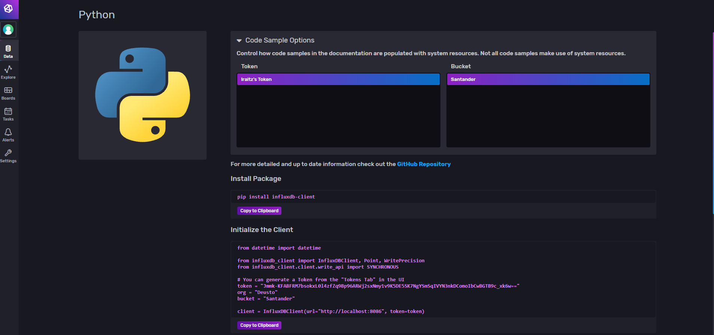
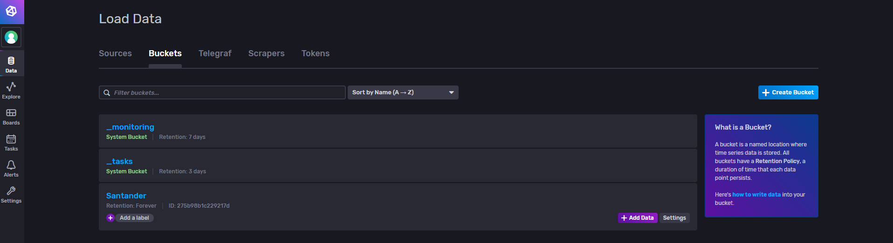
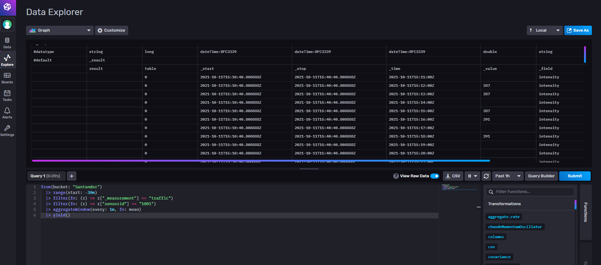

Along this lines we will familiarize ourselves with time series data bases, in this case InfluxDB.


For this code to run a local installation of it is assumed to be running and listening on port 8086. Docker can be easily used for this purpose, just pulling the image and making it run.
```
docker run -d --name=some-influx \
 -p 8086:8086 \
 -v  /tmp/testdata/influx:/root/.influxdbv2 quay.io/influxdb/influxdb:v2.0.3
```
We are good to go. Now, from R there is a library we may use to interact with our database.

```{r}
library(dplyr)
library(magrittr)
library(lubridate)
library(influxdbclient)
```

In order to connect we will need to provide an organization name and a token. this token can be retrieved from the data screen by selecting the language we would like to connect with. Here is the example using Python:



```{r}
# Opens connection to InfluxDb
client <- InfluxDBClient$new(url = "http://localhost:8086", token="my_token", org="my_org")
```

Done! We can interrogate our database about its status.

```{r}
# Ready status
client$ready()
```
```{r}
# Healt info
client$health()
```
And check if there is any bucket that can be used. If we created one using the initial interface it will be shown under *Data > Buckets*




```{r}
client$query('from(bucket:"Santander") |> range(start: -1s)')
```

In order to test InfluxDB's functionalities we will need some sensor data. We can retrieve some data from Santander's open platform for example.


They have traffic sensors all over the city informed every minute or so, thus it should be a good candidate for sensor metrics. You can find more information [here](http://datos.santander.es/resource/?ds=datos-trafico&id=626c514f-d6a0-4efe-95bd-3f1cd4dc531e&ft=CSV).

```{r}
source("../src/dataLoader.R")
data <- load_data()
```

Nice, lets have a look at it.

```{r}
data
```
We will do some cleansing. URL and identifier don't seem to be very useful and idSensor and medida have the same value. Also, name of the measurement (similar to *table* concept in RDBMS) should be assigned, **traffic** in our example.

```{r}
data %<>% 
  select(dc.modified, ayto.medida, ayto.intensidad, ayto.ocupacion, ayto.carga) %>% 
  rename(timestamp = dc.modified, sensorid = ayto.medida, intensity = ayto.intensidad, occupancy = ayto.ocupacion, load = ayto.carga ) %>%
  mutate(timestamp = as_datetime(timestamp, tz = "UTC"))

# Lets add the measurement (table) it belongs to
data[,"_measurement"] <- "traffic"

# And check the output
data
```
Great now that we have our data ready, let's put it into the database. Some things to clarify:

* *bucket*: name of the database where our data will be stored
* *precision*: to be used when timestamp is parsed
* *tags*: tags are how we are going to identify metric types or device identifiers in order to group them afterwards
* *fields*: which columns from our dataframe contain measured values (sensor data)
* *time*: timestamp columns within our dataframe

```{r}
client$write(data, 
             bucket = "Santander", 
             precision = "ms",
             tagCols = c("sensorid"),
             fieldCols = c("intensity", "occupancy","load"),
             timeCol = "timestamp")
```

Great! We have our database informed. Have we? Let's check it out. We need to master Flux for that...
```
from(bucket: "Santander") 
  |> range(start: -1h) 
  |> filter(fn: (r) => r["_measurement"] == "traffic") 
  |> group(columns: ["sensorid"]) 
  |> yield(name: "mean")
```

```{r}
q <- 'from(bucket: "Santander") |> range(start: -1h) |> filter(fn: (r) => r["_measurement"] == "traffic")  |> group(columns: ["sensorid"]) |> yield(name: "mean")'
result <- client$query(q, flatSingleResult = TRUE)
length(result)
```

That's our requested information for all 482 sensor ids. Let's check the first one.

```{r}
result[1]
```


So each measurement will be tagged by a sensor id, given that they are independent from one another. We could ask for information not existent in our database as time series might be required to interpolate their information in order to be useful... Let's try to obtain just the **load** information.
```
from(bucket: "Santander") 
  |> range(start: -1h)
  |> filter(fn: (r) => r["_measurement"] == "traffic")
  |> filter(fn: (r) => r["_field"] == "load") 
  |> group(columns: ["sensorid"]) 
  |> aggregateWindow(every: 10s, fn: mean, createEmpty: true)
  |> yield(name: "mean")
```


```{r}
q <- 'from(bucket: "Santander") |> range(start: -1h) |> filter(fn: (r) => r["_measurement"] == "traffic")|> filter(fn: (r) => r["_field"] == "load") |> group(columns: ["sensorid"]) |> aggregateWindow(every: 10m, fn: mean, createEmpty: true)|> yield(name: "mean")'
result <- client$query(q)
length(result)
```

```{r}
result[1]
```

Well, having only one measured point could be complicated to interpolate. We can keep on adding information so We will define a function that does it for us.

```{r}
addinfo <- function()
{ 
  # Get the information
  data <- load_data()
  # Format and clean
  data %<>% 
    select(dc.modified, ayto.medida, ayto.intensidad, ayto.ocupacion, ayto.carga) %>% 
    rename(timestamp = dc.modified, sensorid = ayto.medida, intensity = ayto.intensidad, occupancy = ayto.ocupacion, load = ayto.carga ) %>%
    mutate(timestamp = as_datetime(timestamp, tz = "UTC"))
  
  # Lets add the measurement (table) it belongs to
  data[,"_measurement"] <- "traffic"
  # Insert
  client$write(data, 
             bucket = "Santander", 
             precision = "ms",
             tagCols = c("sensorid"),
             fieldCols = c("intensity", "occupancy","load"),
             timeCol = "timestamp")
}
```

And keep calling as much as we want. Given that Santander's webpage updates every minute or minute and a half will only check within those intervals.

```{r}
for (i in 1:20){
  addinfo()
  Sys.sleep(90) # Wait for 90 seconds
}
```

Let's see what we have got. Will this loop is running we could check in InfluxDB's interface some of its functionalities for aggregating data for a given sensor.

```
from(bucket: "Santander")
  |> range(start: -1h)
  |> filter(fn: (r) => r["_measurement"] == "traffic")
  |> filter(fn: (r) => r["sensorid"] == "1001")
  |> aggregateWindow(every: 2m, fn: mean, createEmpty: true)
  |> yield()
```

Interpolation of the results

```
import "interpolate"

from(bucket: "Santander")
  |> range(start: -1h)
  |> filter(fn: (r) => r["_measurement"] == "traffic")
  |> filter(fn: (r) => r["sensorid"] == "1001")
  |> toFloat()
  |> interpolate.linear(every: 10s)
  |> yield()
```


Or even some HoltWinters forecasting

```
from(bucket: "Santander")
  |> range(start: -1h)
  |> filter(fn: (r) => r["_measurement"] == "traffic")
  |> filter(fn: (r) => r["sensorid"] == "1001")
  |> holtWinters(n: 10, interval: 1m)
  |> yield()
```


```{r}
q <- 'from(bucket: "Santander")|> range(start: -1h)|> filter(fn: (r) => r["_measurement"] == "traffic")|> filter(fn: (r) => r["sensorid"] == "1001")|> aggregateWindow(every: 2m, fn: mean, createEmpty: true)|> yield()'
result <- client$query(q)
length(result)
```

Nice, three measurements. But being a time series we do know that we will need some intermediate measurements. That is when a Time Series Database becomes handy.

```{r}
result[1]
```

```{r}
result[2]
```

```{r}
result[3]
```

Lets see what happens when we fill missing values with previous measured ones.

```
from(bucket: "Santander")
  |> range(start: -1h)
  |> filter(fn: (r) => r["_measurement"] == "traffic")
  |> filter(fn: (r) => r["sensorid"] == "1001")
  |> aggregateWindow(every: 1m, fn: mean, createEmpty: true)
  |> fill(usePrevious : true)
  |> yield()
```

```{r}
q <- 'from(bucket: "Santander")|> range(start: -1h)|> filter(fn: (r) => r["_measurement"] == "traffic")|> filter(fn: (r) => r["sensorid"] == "1001")|> aggregateWindow(every: 10s, fn: mean, createEmpty: true)|> fill(usePrevious : true)|> yield()'
result <- client$query(q)
result[1]
```

Wait, timestamps have been rounded up and data averaged. So we can ask for information at a given point in time even if it doesn't exist? Yes, but there is no data for those *artificially created* value points in time. Some interpolation might be required and adding our own custom function is even possible. Lets just simply see how it differs from **mean** to **mode** functions

```
from(bucket: "Santander")
  |> range(start: -1h)
  |> filter(fn: (r) => r["_measurement"] == "traffic")
  |> filter(fn: (r) => r["sensorid"] == "1001")
  |> aggregateWindow(every: 1m, fn: mean)
  |> fill(usePrevious : true)
  |> yield()
```


```{r}
q <- 'from(bucket: "Santander")|> range(start: -1h)|> filter(fn: (r) => r["_measurement"] == "traffic")|> filter(fn: (r) => r["sensorid"] == "1001")|> aggregateWindow(every: 1m, fn: mean)|> fill(usePrevious : true)|> yield()'
result <- client$query(q)
result[1]
```

```{r}
q <- 'from(bucket: "Santander")|> range(start: -1h)|> filter(fn: (r) => r["_measurement"] == "traffic")|> filter(fn: (r) => r["sensorid"] == "1001")|> aggregateWindow(every: 1m, fn: mode)|> fill(usePrevious : true)|> yield()'
result <- client$query(q)
result[1]
```

Nice! That's cool. Seems risky to use the mode when mainly zeros are found :) Of course this is much more visual when using the browser based interface.


But of course, data is the same.



Let's clear everything up by calling
```
docker stop some-influx
```
